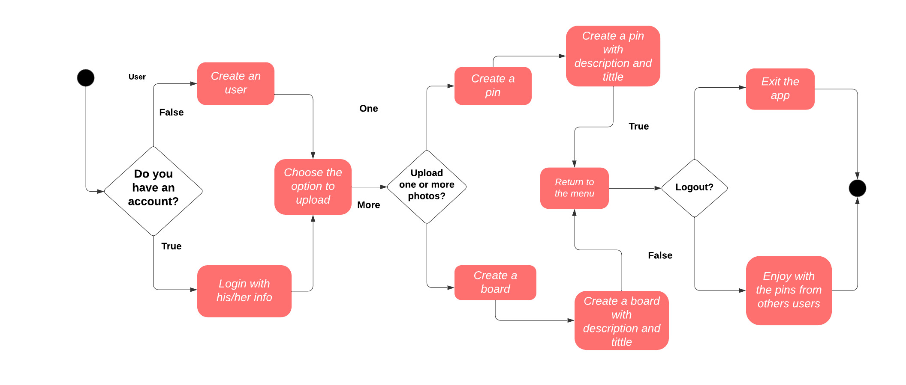
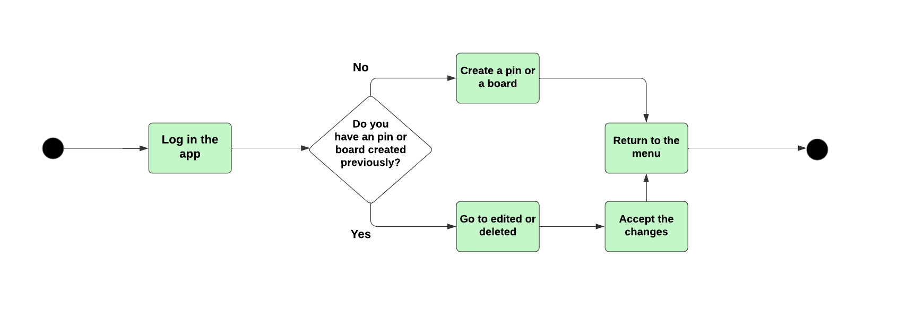
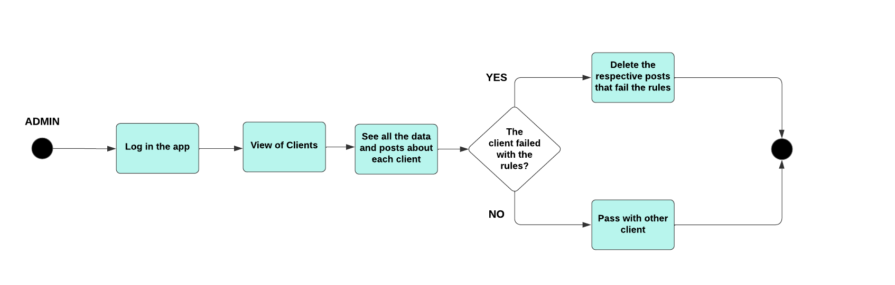
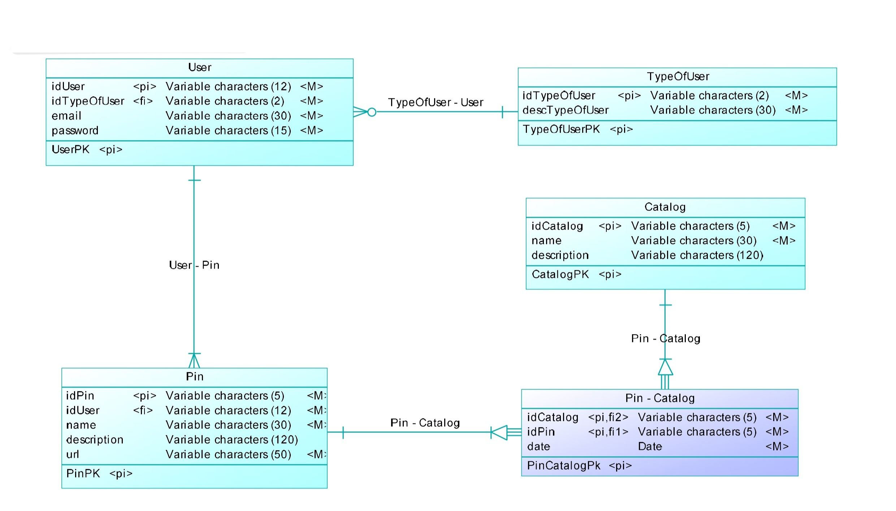
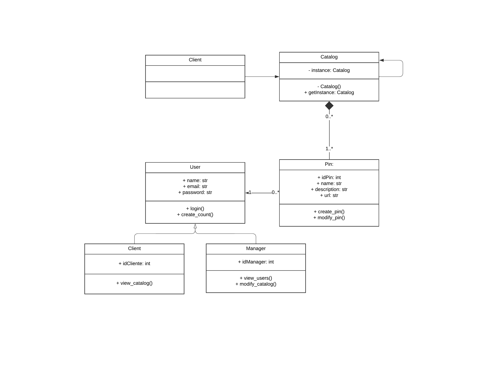

# Project Pin-Board

Project Pin-Board is the final project of the subject software-design from _Universidad Distrital Francisco Jose de Caldas_. Where the main idea is apply the concepts seen in class such as __object-oriented desing__, __dessign patterns__ and __good practices__

## Business Model

The main concept of our app is to help users discover photos shared by others on various __boards__ Through these visual collections, individuals can find _inspiration_ and ideas for their own projects and plans.
The purpose of creating this app is to assist people who encounter difficulties in generating ideas, experiencing moments where their minds go blank

### Business Rules

- Users can create and customize their own boards.
- Boards are public for all 
- Boards must __NOT__ have any illegal content (naked, violence)

### Tools to use

- The enviroment used is Python, using other tools like PostgreSQL and Github for control versions of the project 

## User Stories

- __As a__ _user_,__I want__ to see boards, __so what__ I can get inspiration
- __As a__ _user_,__I want__ upload pins, __so what__ I can share my art
- __As a__ _user_,__I want__ have an account, __so what__ I can save my boards
- __As a__ _user_,__I want__ to see the catalogs, __so what__ I can see other people's work
- __As a__ _manager_,__I want__ to see all the users have the app, __so what__ I can make analysis about it
- __As a__ _manager_,__I want__ to see boards, __so what__ I can decide delete depending on business rules
- __As a__ _manager_,__I want__ to have an special account, __so what__ I can have special permissions such as delete or view the content of users
  

## Technical Definitions

- User: name, username, email, password
- Client(User): IdUser
- Catalog: Id, name, description
- Manager(User): IdManager
- Pin: Id, name, description, url

## Processes

- The user login and upload a pin or create a board

- The user want to delete a photo that upload previously

- The manager will see the clients of the app

## Entity-Relationship Diagram
In the Entity-Relationship Diagram of our project, we have modeled the key relationships between entities. I highlight the following:

- __TypeOfUser__: Represents user types (clients or administrators). It establishes a __one-to-many__ relationship with the User entity.
- __User__: Stores information about registered users. It has a __one-to-many__ relationship with the Pin entity.
- __Pin__: Represents created pins. Each pin is associated with a user. It establishes a __many-to-many__ relationship with the Catalogo entity.
- __Catalogo__: Contains all pins, grouping them. It also establishes a __many-to-many__ relationship with the Pin entity.

## UML Diagram

